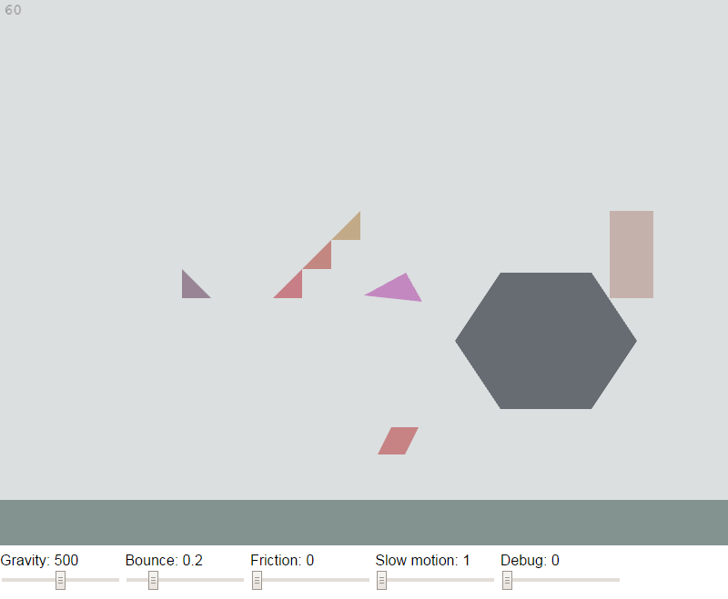

# Phaser SAT Example

An example of using the Separating Axis Theorem for collision handling with
[Phaser](https://github.com/photonstorm/phaser).

**PhaserSat.js** is a heavily commented Phaser scene that puts all of this
together.



I put this together because I'm terrible at maths and wanted to learn how to
perform collision detection and response against sloped tiles. I wanted
something like [this](http://www.metanetsoftware.com/technique/diagrams/tutA_demo.html)
from a [fantastic tutorial](http://www.metanetsoftware.com/technique/tutorialA.html)
by [Metanet](http://www.metanetsoftware.com/).

Even though Phaser has its Ninja Physics engine, which is ported from the very
examples linked above, I wanted to see if it could be done more concisely.

In the end was able to achieve this thanks to the awesome
[SAT.js](https://github.com/jriecken/sat-js) library and this
[very handy tutorial](http://elancev.name/oliver/2D%20polygon.htm#tut4).

## Installation

Install NPM, install Bower, and then install the Bower dependencies.

```bash
npm install -g bower
bower install
```

Open up `index.html` in your browser!

## Controls

**WASD** to move.
